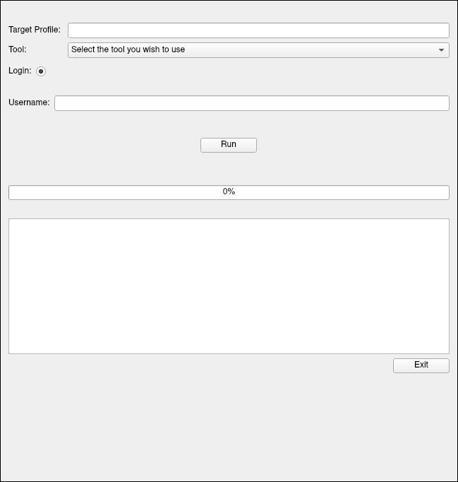

# ig-dler
A GUI based tool which you can use to download DP, highlights, stories, posts of an instagram
profile without using the official instagram API




#### __Prerequisites__

> python 3.7

> A Terminal of course xD


#### __Requirements__


Before running the script you need the following installed.

Packages|
:---:|
pyqt5|
request|
lxml|
pickle|
bs4|

#### How to: 

```
git clone https://github.com/TH3-MA3STRO/ig-dler.git
cd ig-dler
pip install -r requirements.txt
python gui.py
```

then follow the on-screen instructions

#### Author: **Satyam Jha _[TH3-MA3STRO]_** (ig: @th3_ma3stro)
